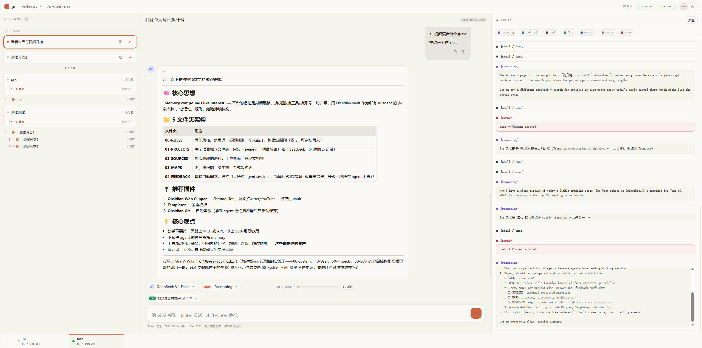
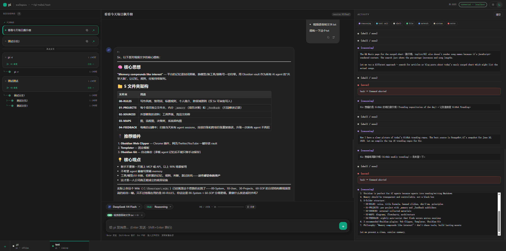

# pi-webui

pi-webui 是一个本地轻量级 WebUI，用来驱动 [Pi Agent](https://github.com/earendil-works/pi)。它不是 Pi 的 fork，而是在 Node 进程里嵌入 `@earendil-works/pi-coding-agent` SDK，把终端里的 session、模型、推理日志和工具调用搬到浏览器里管理。

当前版本定位为 `v0.1`：面向本机使用，优先保证独立运行、会话管理和日常交互顺手。

## 预览





## 功能

- 多 workspace 标签：每个 workspace 绑定一个独立的 Pi runtime。
- Session 列表、切换、新建、删除、重命名、fork、克隆为独立主会话。
- 聊天流式输出，支持 `Esc` 中断当前运行。
- 用户消息和 agent 消息都支持复制与 fork。
- 模型和 Thinking level 下拉切换，直接调用 Pi runtime。
- 右侧日志面板展示 reasoning、tool、shell、file、network、system、error。
- 主题切换：明亮 / 暗黑。

## 安全边界

pi-webui 只绑定 `127.0.0.1`，没有登录系统，也没有远程访问鉴权。它驱动的 Pi runtime 可以运行 shell、编辑文件、写入 workspace，因此不要把端口暴露到局域网或公网。

## 环境要求

- Node.js `>= 22.19.0`
- 已可正常运行的 Pi Agent
- 本机已经完成 Pi 的 provider 登录或密钥配置

如果终端里直接运行 `pi` 能正常工作，pi-webui 会复用同一套本机 Pi 配置和 session 数据。

## 本地开发

```bash
npm install
npm run dev
```

开发模式会启动两个本地服务：

- 前端 Vite：`http://127.0.0.1:9527`
- 后端 API / WebSocket：`http://127.0.0.1:9529`

浏览器打开：

```text
http://127.0.0.1:9527
```

前端开发服务器会把 `/api` 和 `/ws` 代理到后端。

## 部署 / 本机运行

构建后运行：

```bash
npm install
npm run build
npm run start
```

生产模式只需要一个服务：

```text
http://127.0.0.1:9529
```

后端会同时提供 API、WebSocket 和 `web/dist` 里的前端静态文件。

## 常用命令

| 命令 | 说明 |
| --- | --- |
| `npm run dev` | 同时启动后端和前端开发服务器 |
| `npm run dev:server` | 只启动后端开发服务器 |
| `npm run dev:web` | 只启动前端 Vite |
| `npm run build` | 构建前端和后端 |
| `npm run start` | 启动构建后的本机服务 |
| `npm run typecheck` | 检查 server 和 web 的 TypeScript 类型 |

## 配置

| 环境变量 | 默认值 | 说明 |
| --- | --- | --- |
| `PI_WEBUI_PORT` | `9529` | 后端端口。开发时 Vite 会代理到这个端口 |
| `PORT` | 空 | 后端端口 fallback，优先级低于 `PI_WEBUI_PORT` |
| `HOST` | `127.0.0.1` | 后端绑定地址，建议保持默认 |
| `PI_WEBUI_STATE` | `.pi-webui-state.json` | WebUI 自己的 workspace 标签状态文件 |

## 项目结构

```text
server/        Node + Hono 后端，嵌入 Pi SDK
web/           React + Vite 前端
docs/images/   README 截图
```

## 说明

pi-webui 会读取 Pi 的本地 session 和设置，但自己的 UI 状态只写入项目根目录的 `.pi-webui-state.json`。这个文件已被 `.gitignore` 忽略，不会进入版本库。

## License

MIT
